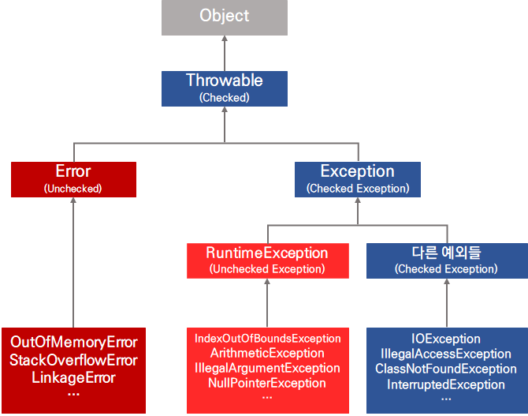

## 11. 예외처리

### 1. 에러와 예외

- Error: 메모리 부족, stack overflow와 같이 발생하면 복구할 수 없고 디버깅이 필요한 것
- Exception: 읽으려는 파일이 없거나, 네트워크 연결 등 프로그램 코드에 의해 수습될 수 있는 상황

<br>

### 2. 예외 클래스의 계층



- checked exception: 예외에 대한 대처 코드가 없으면 컴파일이 진행되지 않음
- unchecked exception (RuntimeException의 하위 클래스): 예외에 대한 처리가 없더라도 컴파일이 가능

<br>

### 3. exception handling

- try catch finally 구문

```java
try {  // 작은 범위(자식)부터 큰 범위(조상) 순으로 정의한다.
    // 예외 발생 가능 코드
} catch (XXException e) {
    // XX 에외 발생시 처리할 코드
} catch (YYException | ZZException e) {
    // YY나 ZZ 예외 발생시 처리할 코드
} catch (Exception e) {
    // Exception 발생시 처리 코드
} finally {
    // 언제나 실행되는 코드
}
```

- Throwable의 주요 메서드

  public String getMessage(): 발생된 예외에 대한 구체적인 메시지를 반환한다.

  public Throwable getCause(): 예외의 원인이 되는 Throwable 객체 또는 null을 반환한다

  public void printStackTrace(): 예외가 발생한 메서드가 호출되기까지의 메서드 호출 스택을 출력한다.


- throws 구문

  method에서 처리해야 할 예외를 호출한 곳에서 처리하도록 위임

  checked exception은 반드시 try catch 또는 throws 가 필요하다

```java
public class Example {
    
    public static void main(Strings[] args) {
		byte[] recive = new byte[128];
        
        tre {
            Read(recive);
        } catch (IOException e) {
        }
    }
    
    public static void Read(byte[] buffer) throws IOException {
        System.in.read(buffer);
    }
}
```

