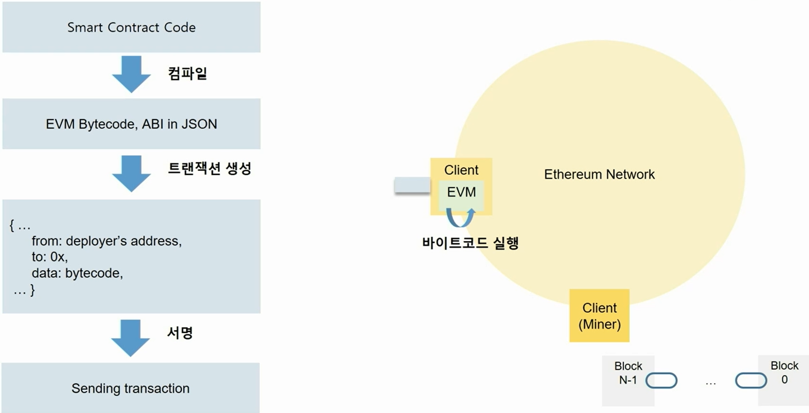

## NFT

### MetaMask

- 블록체인 네트워크를 사용할 수 있도록 계정의 개인키를 관리하는 프로그램을 지갑(Wallet)이라 한다. (개인키로 sign하여 트랜잭션을 보내 거래한다)
- MetaMask는 크롬의 확장 프로그램으로 암호화폐 지갑이다.

- 개인키는 256bit의 무작위 숫자이며 다음과 같은 생성 절차를 갖는다.
  1. 64자리의 Hex값으로 인코딩한다.
  2. 타원곡선전자서명 알고리즘(ECDSA, secp256k1)을 사용하여 공개키를 생성한다.
  3. Keccak-256 hashing function을 이용해 새로운 값으로 변환한다.
  4. 변환한 값의 마지막 20byte(40자리)를 계정 주소로 한다.

- Ethereum Mainnet 은 진짜 이더리움을 통해 거래하며 Test Network는 가짜 토큰을 이용한다.
- faucet을 이용해 테스트 이더리움을 받을 수 있다.


### Provider API

- 클라이언트를 통해 이더리움 네트워크에 접근할 수 있도록 제공된 Javascript 객체
- MetaMask API Docs의 콘솔창에서 ethereum이란 객체를 호출해 이용한다.


### Smart Contract

- 디지털 형식으로 명시된 서약(Commitment)들의 집합으로 단순 컴퓨터 프로그램이다.

- 법적 맥락은 없으며, 자연어의 모호함을 피하기 위해 프로그래밍 언어로 만든 서약이다.

- 블록체인에서의 정의는 불변의 컴퓨터 프로그램을 말한다. 즉 한번 배포되면 변경이 불가한 프로그램이며, EVM(Ethereum Virtual Machine) 위에서 동작한다.

- Solidity, LLL, Viper, Assembly 같은 언어를 이용한다.


- 생성 순서
  1. Smart Contract code를 작성, 컴파일한다.
  2. EVM Bytecode, ABI json interface가 생성된다.
  3. 트랜젝션 data에 bytecode가 담기고 이를 서명한다.
  4. 바이트코드가 Client EVM에서 실행되어 전파된다.
  5. 배포된 컨트랙트 주소(CA contract Address)와 ABI를 통해 함수 호출이 가능하다.




### Remix IDE

- 대표적인 웹 스마트 컨트랙트 IDE이다.


### Solidity Language Contract

```solidity
// SPDX-License-Identifier: GPL-3.0		// 소스코드의 라이선스
pragma solidity >=0.7.0 < 0.9.0;		// 소스코드가 이용하는 컴파일러 버전. major.minor.patch

contract Storage {
	
	uint256 number;		// 상태변수 접근 제어자 지정 가능(external, public, private)
	
	function store(uint256 num) public {	// 컨트랙트 단위 기능
		number = num;
	}
	
	function retrieve() public view returns (uint256) {
		return number;
	}
}
```


#### 1. 자료형

##### 1.1 기본형 Primitives

- 논리형

  bool : true or false

- 정수형 : 8 ~ 256 bit를 표현할 수 있으며, unit는 uint256과 같다.

  uint : unsigned integer

  int : signed integer

- 주소형

  address : 이더리움의 주소를 표현한다. 0x로 시작한다.

- 바이트형

  bytes# or byte[] : 데이터를 바이트로 표현할 수 있다.