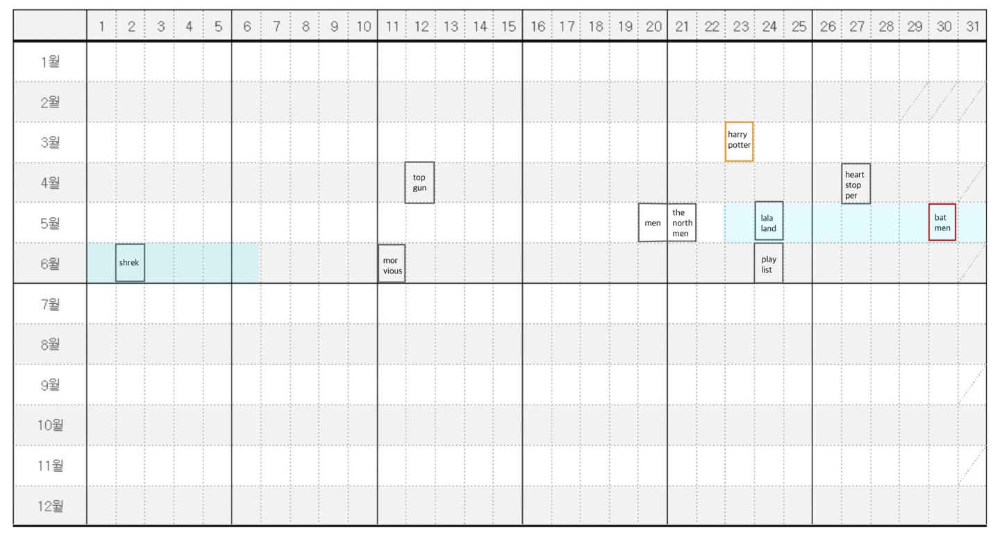
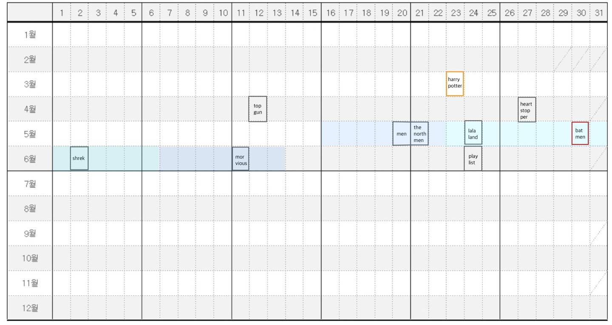

## 문제 만들기

### 개인 - 카드게임

#### 1. 문제 설명

카드 게임을 T라운드 진행한다.


매 라운드에서

플래이어는 (킹, 퀸, A, 2, 3, 조커) 카드를 1장씩 갖게되며,

카드 순서를 정해서 6번의 카드 겨루기를 한다


킹(1) : 퀸, A, 2, 3을 이긴다.

퀸(2) : A, 2, 3을 이긴다.

A(3) : A, 2, 3과 비기며 조커를 이긴다.

2(4) : A, 2, 3과 비기며 조커를 이긴다.

3(5) : A, 2, 3과 비기며 조커를 이긴다.

조커(6) : 킹을 이긴다


이기면 점수 8점

비기면 점수 3점

지면 점수 0점


이겼을 때 이전 카드 겨루기에서

- 킹을 냈으면 추가점수 1점
- 퀸을 냈으면 추가점수 2점
- 조커를 냈으면 추가점수 3점

졌을 때 이전 카드 겨루기에서

- 킹을 냈으면 추가점수 -3점
- 퀸을 냈으면 추가점수 -2점
- 조커를 냈으면 추가점수 -1점


상대방의 카드 제출 순서 전체 혹은 일부가 주어졌을 때, 최악의 경우에도(보여지지 않은 상대방 카드가 무슨 수를 내든) 최저점이 제일 높은 내 카드 순서를 출력하시오. (동점이 있으면 카드번호가 낮은 것을 출력)


#### 2. 입출력 설명

첫째줄에 라운드의 수 T가 주어진다. 그 이후로 오는 T줄은 각 한 라운드를 의미하며 상대방의 패가 6자리 숫자로 주어진다. 상대방의 패가 공개된 경우 카드번호 숫자(1부터 6까지)가, 공개되지 않으면 0이 적힌다.


- 입력 예시

10

1 2 3 4 5 6

6 5 4 3 2 1

0 6 5 4 3 0

0 1 0 4 3 6

2 5 3 0 0 0

0 0 1 0 0 6

0 0 1 0 0 3

2 1 4 5 0 0

0 0 5 6 0 2

0 0 0 3 2 0

- 출력 예시

#1 6 1 4 3 2 5

#2 4 5 3 2 1 6

#3 1 6 4 3 2 5

#4 1 6 4 3 2 5

#5 1 2 3 4 5 6

#6 3 2 6 1 4 5

#7 4 1 6 5 3 2

#8 1 6 3 2 4 5

#9 4 3 2 5 6 1

#10 3 2 4 6 1 5


#### 3. 문제 예시 설명

위의 tc 1번의 경우 상대방의 패가 1 2 3 4 5 6 으로 전부 주어졌다. 이 경우 6 1 4 3 2 5 로 패를 냈을 때 가장 큰 점수를 얻을 수 있다.


위의 tc 5번의 경우 상대방의 패 2 5 3 0 0 0 에서 0 자리에 남은 카드 1, 4, 6이 올 수 있다.

만일 내 카드를 1 2 3 4 6 5 로 냈을 때, 상대방의 카드가 2 5 3 1 4 6 으로 나온다면 37점을 얻지만, 2 5 3 4 6 1 로 나온다면 25점을 얻는다. 하지만 내 카드를 1 2 3 4 5 6 으로 낸다면 상대방의 카드가 무엇이 나오든 29점이 보장된다. 따라서 1 2 3 4 6 5 보다 1 2 3 4 5 6 의 카드순서가 더 좋은 순서이며 29점 이상을 보장하는 다른 카드순서가 없으므로 1 2 3 4 5 6 이 답이된다.


#### 4. 문제 보완 가능성

이겼을 때, 졌을 때 점수 계산이 가감점 때문에 지저분한 면이 있다. => 가감점 삭제

카드 6개 중 3개가 중복된다. => 필요에 따라 A, 2, 3을 A 하나로 통일

출력이 "#tc 카드번호6자리" 로 지저분해 보일 수 있다. => 카드번호 대신 받을 수 있는 최대 점수를 출력


#### 5. 문제 출체 의도

분류 : DFS 랑 구현


#### 6. 답안 참고 코드

```python
# 점수 구하는 함수가 지저분한데, 가감점을 삭제하면 깔끔해 질 것 같다.
def cal_score(my_arr, arr, k):
    me = my_arr[k]
    opp = arr[k]

    # 킹으로 이긴 경우
    if me == 1 and (opp != 1 and opp != 6):
        if k > 0:
            if my_arr[k - 1] == 2:
                return 10
            elif my_arr[k - 1] == 6:
                return 11
        else:
            return 8
    # 킹으로 지는 경우
    if me == 1 and opp == 6:
        if k > 0:
            if my_arr[k - 1] == 2:
                return -2
            elif my_arr[k - 1] == 6:
                return -1
        else:
            return 0

    # 퀸으로 이긴 경우
    if me == 2 and (opp != 1 and opp != 2):
        if k > 0:
            if my_arr[k - 1] == 1:
                return 9
            elif my_arr[k - 1] == 3:
                return 11
        else:
            return 8
    # 퀸으로 지는 경우
    if me == 2 and opp == 1:
        if k > 0:
            if my_arr[k - 1] == 1:
                return -3
            elif my_arr[k - 1] == 6:
                return -1
        else:
            return 0

    # A, 2, 3으로 이기는 경우
    if opp == 6 and (me == 3 or me == 4 or me == 5):
        if k > 0:
            if my_arr[k - 1] == 1:
                return 9
            elif my_arr[k - 1] == 2:
                return 10
            elif my_arr[k - 1] == 6:
                return 11
        else:
            return 8
    # A, 2, 3으로 지는 경우
    if (opp == 1 or opp == 2) and (me == 3 or me == 4 or me == 5):
        if k > 0:
            if my_arr[k - 1] == 1:
                return -3
            elif my_arr[k - 1] == 2:
                return -2
            elif my_arr[k - 1] == 6:
                return -1
        else:
            return 0

    # 조커로 이기는 경우
    if me == 6 and opp == 1:
        if k > 0:
            if my_arr[k - 1] == 1:
                return 9
            elif my_arr[k - 1] == 2:
                return 10
        else:
            return 8
    #조커로 지는 경우
    if me == 6 and opp != 1:
        if k > 0:
            if my_arr[k - 1] == 1:
                return -3
            elif my_arr[k - 1] == 2:
                return -2
        else:
            return 0

    # 비기는 경우
    return 3


def opp_card(k, arr, counts, res):
    global ans, my_arr, ans_list

    if k == 6:
        # 상대방 카드패가 완성된 경우 내 카드패와의 점수를 확인. 최솟값만 저장한다.
        if res < ans:
            ans = res
            ans_list = arr[::]

    elif arr[k] != 0:
        opp_card(k + 1, arr, counts, res + cal_score(my_arr, arr, k))

    # 백트래킹
    elif res - 3 - 2 - max((6 - k - 2), 0) > ans:
        return

    else:
        for i in range(1, 7):
            if counts[i] > 0:
                arr[k] = i
                counts[i] = 0

                opp_card(k + 1, arr, counts, res + cal_score(my_arr, arr, k))

                arr[k] = 0
                counts[i] = 1


def my_card(k, my_counts, counts):
    global ans, answer, arr, my_arr, answer_list, ans_list

    if k == 6:
        # 내 카드패를 완성했으면 상대방의 카드조합을 만든다.
        opp_card(0, arr, counts, 0)
        # 상대방이 만들 수 있는 카드패들에게 내가 얻을 수 있는 최악의 점수(ans)를 최댓값이 되도록 하는 내 카드패를 찾는다.
        if answer < ans:
            answer = ans
            answer_list = my_arr[::] + ["/"] + ans_list
        ans = 10000

    else:
        for i in range(1, 7):
            if my_counts[i] > 0:
                my_arr[k] = i
                my_counts[i] = 0
                my_card(k + 1, my_counts, counts)
                my_counts[i] = 1


T = int(input())
for tc in range(1, T + 1):
    arr = list(map(int, input().split()))  # 상대 카드패 순서
    my_arr = [0] * 6  # 내 카드패 순서
    counts = [1] * 7  # 상대 남은 카드패를 기록
    ans_list = []  # 내 답안 카드패를 최저점으로 만드는 opp 카드패의 순서
    answer_list = []  # 내 답안 카드패 + ans_list

    for card in arr:
        if card != 0:
            counts[card] -= 1

    ans = 10000
    answer = 0
    my_card(0, [1] * 7, counts)
    # print(answer)
    print(f'#{tc}', end=" ")
    print(*answer_list[:6])
```


### 팀 - 영화 추천 알고리즘 

#### 1. 문제설명

올해는 고전 명작들의 재개봉 붐으로 인해 수많은 영화들이 신작 영화와 함께 다시 극장에서 상영되고 있다. taki는보고싶었던 외국영화를 선택하고, 함께 개봉한 인기 외국영화리스트를 만들어 친구에게 추천하려고 한다. 하지만 영화 데이터를 받아오는 과정에서 문제가 생겨 이미 저장된 영화에 다른 영화의 데이터가 들어오는 경우가 생겼다. 따라서 같은 영화의 경우 개봉일이 가장 빠른 데이터가 진짜 데이터이다.

의미있는 데이터를 보려면 가장 인기있는 영화를 제외하고 적어도 3개의 영화가 필요하기 때문에, 출력 결과에는 항상 3개의 영화를 포함한다. 또한, 7일 이내의 영화가 14일 이내의 영화보다 상관관계가 더 크다고 생각해 7일 이내에 3개이상 영화가 존재한다면 3개의 영화리스트를 저장한다. 만약, 14일 이내에 3개의 영화를 포함하지 못한다면 의미없는 데이터셋으로 판단해 영화리스트로 저장하지 않고 빈리스트([])을 출력한다.

만들어진 영화리스트는 평점순으로 정렬해 보여주며, 만약 평점이 같다면 영화제목 사전순으로 정렬한다. 이러한 조건을 만족하는 영화 추천리스트를 만들어보자!!


#### 2. 영화 입력 예시 [달력] 

> 기준영화와 입력받은 영화 리스트



- :red_circle: : 기준점

- :full_moon: : 중복된 영화

- :black_circle: : 개봉일이 다른 영화


> 기준영화의 개봉일과 비슷한 영화 3개 추천


- 개봉일이 비슷한 기준 : 전후 7일
- 추천 영화가 3개가 미만일 때 : 개봉일이 비슷한 기준을 전후 14일로 늘려야한다.

- 중복된 영화는 개봉일이 앞선 영화만을 고려한다.


> 기준영화 개봉일과 비슷한 영화 3개 추천 (2)



- 개봉일이 비슷한 기준 : 전후 14일
- 추천영화가 3개 이상이 되었을 때 : 평점 기준 상위 3개만을 고려한다.


> 결과 예시


- `#1 ['morbius', 'lalaland', 'shrek']`


#### 3. 제약 사항

- 모든 영화의 개봉년도는 2월이 28일까지인 2022년이다. 

- 영화제목이 같을 수 있지만, 개봉날짜가 같은 영화는 주어지지 않는다.

- 주어진 영화의 제목은 모두 영어이며, 띄어쓰기가 존재한다. ex)Harry Potter

- 영화의 제목을 공백 없는 소문자로  바꿨을 때 철자가 같다면, 영화는 같은 걸로 취급한다.
  - ex)Harry Potter => harrypotter

- 영화가 중복이 된다면, 더 일찍 개봉한 영화를 선택한다.


#### 4. 난이도

SWEA-D3 수준


#### 5. 입력

첫 줄에 테스트 케이스의 갯수가 주어지고, 테스트 케이스의 첫 번째 줄에는 영화의 개수 N, 두번째 줄에는 선택한 영화의 날짜와 이름이 주어지고, 다음 줄부터 N개의 줄에  3씩의 데이터(개봉일, 영화 제목, 평점)가 리스트에 담겨 제공된다.

```
5 
10
05/30 Batman
06/11 Morbius 4.8
04/27 Heartstopper 4.7
05/26 HarryPotter 4.5
05/24 LalaLand 4.3
06/02 Shrek 4.0
04/12 Top Gun 3.8
03/23 HarryPotter 3.6
05/20 Men 2.2
06/24 Playlist 1.5
05/21 The Northman 1.3
6 
07/01 Hancock
04/02 Hellboy 6.5
09/19 Tusk 5.1
07/10 The Gallows 4.9
08/27 Mary Poppins 7.4
07/21 Salt 6.2
09/02 The Crying Game 6.9
9 
06/07 The Internship
03/16 I Think I Love My Wife 5.0
12/21 Curse of the Golden Flower 6.6
12/22 Snow Falling on Cedars 6.3
02/23 Mary Reilly 5.7
09/28 The Game Plan 6.0
07/01 Deliver Us from Evil 5.9
01/17 The Cooler 6.7
10/18 West Side Story 7.0
07/18 R.I.P.D. 5.4
10 
08/19 Red State
09/14 Inescapable 5.2
08/18 The Illusionist 7.1
08/13 Detroit Rock City 6.7
12/11 Rocket Singh: Salesman of the Year 7.0
09/05 Freddy's Dead: The Final Nightmare 5.1
01/26 Rang De Basanti 7.2
12/24 The Lady from Shanghai 7.2
08/18 Vampires Suck 4.2
08/17 The Legend of Suriyothai 5.1
05/21 Pearl Harbor 6.6
22 
12/14 A Passage to India
10/26 All Superheroes Must Die 4.2
09/28 The Other Dream Team 6.9
04/04 Blow 7.4
06/17 The Art of Getting By 6.5
04/16 Slow West 6.6
07/24 The Vatican Tapes 4.6
07/10 Journey to the Center of the Earth 5.8
12/18 The Black Hole 6.1
01/01 Prophecy 5.4
09/09 Albino Alligator 5.6
01/22 The Boondock Saints 7.2
12/17 Arn: The Knight Templar 6.4
06/17 Superman III 5.3
12/20 Out of Africa 7.0
06/01 Crying with Laughter 7.0
08/09 Escape from L.A. 5.6
04/10 The Marine 4: Moving Target 5.8
08/17 Ben-Hur 5.3
12/09 The Painted Veil 7.1
04/24 Valley of the Heart's Delight 7.0
03/10 Deterrence 6.1
06/22 Independence Day: Resurgence 4.9
```


#### 6. 출력

'#tc번호'와 1번부터 시작하는 조건을 만족하는 세개의 영화로 이루어진 리스트를 출력한다. 조건을 만족하는 리스트가 없으면 []을 출력한다.

```
#1 ['morbius', 'lalaland', 'shrek']
#2 []
#3 []
#4 ['theillusionist', 'detroitrockcity', 'thelegendofsuriyothai']
#5 ['thepaintedveil', 'outofafrica', 'arn:theknighttemplar']
```


#### 7. 답안 예시

```python
months = {1: 31, 2: 28, 3: 31, 4: 30, 5: 31, 6: 30, 7: 31, 8: 31, 9: 30, 10: 31, 11: 30, 12: 31}

def solution(choice, movies):
    new_movies = []

    # movie를 [score, date, title]형태로 저장하며 제목이 중복되는 경우 개봉일이 빠른 영화만 담기
    for movie in movies:
        # 개봉일
        date = 0
        for month in range(1, int(movie[:2]) + 1):
            date += months[month]
        date += int(movie[3:5])

        # 평점
        score = float(movie[-3:])

        # 제목
        title = movie[5:-3].strip().replace(" ", "").lower()

        # new_movies에 넣기
        i = 0
        while i < len(new_movies):
            if new_movies[i][2] == title:
                if new_movies[i][1] <= date:
                    break
                else:
                    new_movies.pop(i)
                    new_movies.append([score, date, title])
                    break
            else:
                i += 1
        else:
            new_movies.append([score, date, title])
    
    # score 내림차순으로, title는 오름차순으로(a보다 b가 더 크다) 나열
    new_movies.sort(key=lambda x: (-x[0], x[2]))

    # choice의 date를 계산해서 movie date와 비교
    choice_date = 0
    for month in range(1, int(choice[:2]) + 1):
        choice_date += months[month]
    choice_date += int(choice[3:5])

    answer = []
    for limit in [7, 14]:
        for movie in new_movies:
            score, date, title = movie
            if abs(choice_date - date) <= limit:
                answer.append(title)
        # 만약 7일 전후로 영화 개수가 3개를 넘지 않으면 limit을 14로 늘린다
        if len(answer) >= 3:
            return answer[:3]
        else:
            answer = []

    if len(answer) >= 3:
        return answer[:3]
    else:
        return []

T = int(input())
for tc in range(1, T + 1):
    N = int(input())
    choice = input()
    movies = []
    for _ in range(N):
        movies.append(input())
    print(f'#{tc} {solution(choice, movies)}')
```


#### 8. 추가 파일들

- [위치](./creating_problem_22-05-30.assets)

- 목록
  - sample_input.txt
  - sample_output.txt
  - eval_input.txt
  - eval_output.txt
  - InputGenerator.py
  - movie.json
  - 알고리즘.pptx
  - solution.py
